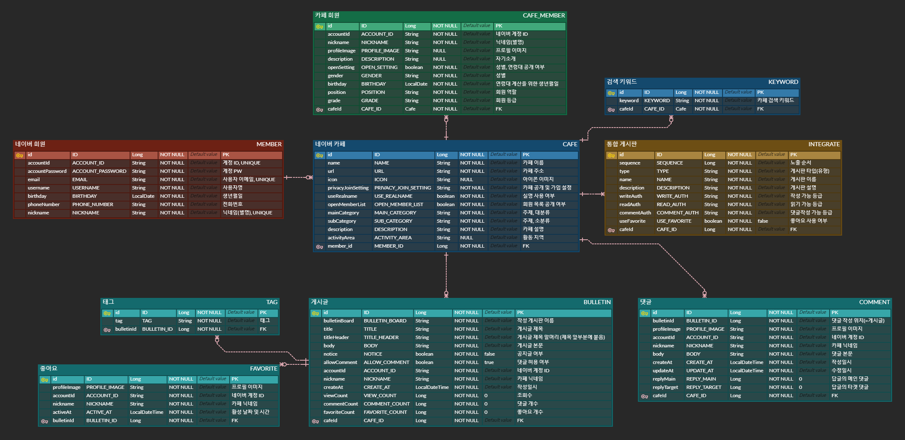

# Clone Coding - Naver Cafe
## 서비스 분석
네이버 카페 서비스에 대한 분석을 통해 해당 시스템이 제공하는 기능들에 대해 파악하고 정리하였다.
- 직접 시스템을 하나하나 확인해 보며 분석했으며, 하단 링크 블로그에 정리 해두었다.
- [네이버 카페 시스템 분석 (by.개인 블로그)](https://development-diary-for-me.tistory.com/2)  
  

## 설정
[프로젝트 설정 및 데이터베이스 연결 설정](https://development-diary-for-me.tistory.com/3)  
  

## ERD
  
  

## 구현 스펙
기능 구현에 대한 내용을 개인 블로그에 포스팅 해두었다. 항목 클릭 시 해당 포스팅으로 이동된다.
1. 네이버 회원
   - [네이버 회원 가입(등록)](https://development-diary-for-me.tistory.com/4)
   - [예외 처리](https://development-diary-for-me.tistory.com/5)
   - [네이버 회원 정보 조회(읽기)](https://development-diary-for-me.tistory.com/6)
   - [네이버 로그인](https://development-diary-for-me.tistory.com/7)
   - [네이버 로그아웃](https://development-diary-for-me.tistory.com/8)
   - [네이버 회원 정보 수정](https://development-diary-for-me.tistory.com/9)
   - [네이버 회원 탈퇴](https://development-diary-for-me.tistory.com/10)
2. 네이버 카페
   - [카페 만들기](https://development-diary-for-me.tistory.com/12)
   - [회원 가입](https://development-diary-for-me.tistory.com/13)
   - [회원정보 수정](https://development-diary-for-me.tistory.com/14)
   - [회원 탈퇴](https://development-diary-for-me.tistory.com/15)
   - [카페 생성시 기본 게시판](https://development-diary-for-me.tistory.com/16)
   - [통합게시판 추가](https://development-diary-for-me.tistory.com/17)
   - [통합게시판 수정](https://development-diary-for-me.tistory.com/18)
   - [(통합게시판) 게시글 작성](https://development-diary-for-me.tistory.com/19)
   - [(통합게시판) 게시글 수정](https://development-diary-for-me.tistory.com/20)
   - [(통합게시판) 게시글 읽기](https://development-diary-for-me.tistory.com/21)
   - [(통합게시판) 게시글 삭제](https://development-diary-for-me.tistory.com/22)
   - [(통합게시판) 태그 추가, 수정(삭제)](https://development-diary-for-me.tistory.com/23)
   - [게시글 '좋아요' 등록, 취소](https://development-diary-for-me.tistory.com/24)
   - [댓글 작성](https://development-diary-for-me.tistory.com/25)
   - [답글 작성](https://development-diary-for-me.tistory.com/26)
   - [댓글 읽기](https://development-diary-for-me.tistory.com/27)
   - [댓글 수정](https://development-diary-for-me.tistory.com/28)
   - [댓글 삭제](https://development-diary-for-me.tistory.com/29)