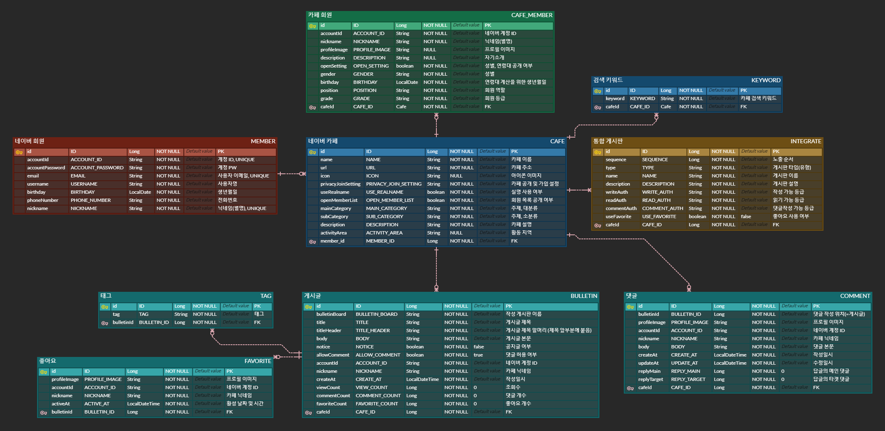

# Naver Cafe - Clone Coding
네이버카페 서비스 백엔드 스펙 구현, 클론 코딩 프로젝트 입니다.
   

## 목차
- [개발 환경](#개발-환경)
- [사용 기술](#사용-기술)
  - [백엔드](#백엔드)
  - [기타 주요 라이브러리](#기타-주요-라이브러리)
- [핵심 키워드](#핵심-키워드)
- [ERD](#erd)
- [프로젝트 목적](#프로젝트-목적)
  - [네이버카페-클론 코딩 프로젝트 시작 계기](#네이버카페-클론-코딩-프로젝트-시작-계기)
  - [프로젝트를 통해 하고 싶었던 것](#프로젝트를-통해-하고-싶었던-것)
- [서비스 분석](#서비스-분석)
- [구현 기능](#구현-기능)
- [프로젝트를 통해 느낀점](#프로젝트를-통해-느낀점)
- [프로젝트 관련 포스팅](#프로젝트-관련-포스팅)
  

## 개발 환경
- IntelliJ
- Postman
- GitHub
- MySQL
  

## 사용 기술
### 백엔드
#### 주요 프레임워크 및 라이브러리
   - Java 17 Amazon Corretto
   - Spring Boot 3.2.5
   - Spring Data JPA
   - QueryDSL
   - Validation
#### Build tool
   - Gradle
#### DB
   - MySQL
### 기타 주요 라이브러리
- Lombok
- Json Web Token
  

## 핵심 키워드
- Java, Spring Boot 를 활용한 웹 서비스의 백엔드 구현 경험
- 네이버카페 서비스 파악 및 분석
- 도메인 주도 설계(Domain-Driven Design)를 통한 도메인 설계
  

## ERD

  

## 프로젝트 목적
### '네이버카페-클론 코딩' 프로젝트 시작 계기
최소한의 구현능력을 학습하고 포트폴리오를 준비하기로 마음 먹었을 때는 머리가 복잡하였습니다. 

하지만 '클론 코딩' 이라는 개념을 알게되고 '내가 자주 사용해본 웹 사이트를 구현하면 어떨까?' 라는 생각을 하게 되었습니다. 

머리에 떠오른 다양한 웹 사이트들 중, 비교적 최근까지 사용했기에 서비스 분석을 더 상세히 할 수 있고, 어떠한 서비스들을 사용자들이 주로 사용하는지 파악하고 있는 '네이버카페' 를 선택하게 되었고, '네이버카페'가 제공하는 서비스를 하나하나 구현하게 되었습니다. 

### 프로젝트를 통해 하고 싶었던 것
현재 서비스되고 있는 '네이버카페'에서 사용자에게 제공되는 서비스를 하나씩 다루어보며 그 서비스를 실제로 구현할 수 있는지 확인하고 싶었습니다. 

지금껏 개발 공부를 하였지만 이론과 예제에 맞춘 실습 경험만을 가지고 있어 불안감이 있었는데, 해당 프로젝트를 통해 내가 목표로하는 것을 구현하고 그 결과로 개발에 대한 자신감을 가지고 싶었습니다.
  

## 서비스 분석
네이버카페 서비스에 대한 분석을 통해 해당 서비스가 제공하는 기능에 대해 파악 및 정리 하였습니다.
- [네이버카페 시스템 분석](https://development-diary-for-me.tistory.com/2)
  

## 구현 기능
구현한 기능에 대한 내용을 포스팅 해두었습니다.
### 네이버
   - [네이버 회원 가입(등록)](https://development-diary-for-me.tistory.com/4)
   - [예외 처리](https://development-diary-for-me.tistory.com/5)
   - [네이버 회원 정보 조회(읽기)](https://development-diary-for-me.tistory.com/6)
   - [네이버 로그인](https://development-diary-for-me.tistory.com/7)
   - [네이버 로그아웃](https://development-diary-for-me.tistory.com/8)
   - [네이버 회원 정보 수정](https://development-diary-for-me.tistory.com/9)
   - [네이버 회원 탈퇴](https://development-diary-for-me.tistory.com/10)
### 네이버카페
   - [카페 생성](https://development-diary-for-me.tistory.com/12)
   - [카페 회원 가입](https://development-diary-for-me.tistory.com/13)
   - [회원정보 수정](https://development-diary-for-me.tistory.com/14)
   - [회원 탈퇴](https://development-diary-for-me.tistory.com/15)
   - [카페 생성시 기본 게시판](https://development-diary-for-me.tistory.com/16)
   - [통합게시판 추가](https://development-diary-for-me.tistory.com/17)
   - [통합게시판 수정](https://development-diary-for-me.tistory.com/18)
   - [(통합게시판) 게시글 작성](https://development-diary-for-me.tistory.com/19)
   - [(통합게시판) 게시글 수정](https://development-diary-for-me.tistory.com/20)
   - [(통합게시판) 게시글 읽기](https://development-diary-for-me.tistory.com/21)
   - [(통합게시판) 게시글 삭제](https://development-diary-for-me.tistory.com/22)
   - [(통합게시판) 태그 추가, 수정(삭제)](https://development-diary-for-me.tistory.com/23)
   - [게시글 '좋아요' 등록, 취소](https://development-diary-for-me.tistory.com/24)
   - [댓글 작성](https://development-diary-for-me.tistory.com/25)
   - [답글 작성](https://development-diary-for-me.tistory.com/26)
   - [댓글 읽기](https://development-diary-for-me.tistory.com/27)
   - [댓글 수정](https://development-diary-for-me.tistory.com/28)
   - [댓글 삭제](https://development-diary-for-me.tistory.com/29)
  

## 프로젝트를 통해 느낀점
다른 분야에서 취업을 준비하고 취업을 하기도 했지만 재취업에 어려움을 느끼고 방황하던 도중에 시작한 코딩 공부가 이 프로젝트까지 이어졌습니다. 

다시 시작한 프로그래밍은 즐거우면서도 망설여졌습니다. 하지만 막히는 부분이 있을 때마다 '이 부분만 해결하고 자야지'하며, 새벽까지 모니터 화면 앞에서 고민하고 있는 제 모습을 자각했을 때 도전하고 싶다는 마음을 확인 할 수 있었습니다. 

또한 아직 부족한 것이 너무 많아, 개발을 할 때 마다 새로 학습해야 할 내용이 계속해서 등장하지만 '힘들다, 지친다' 라는 생각보다는 '저걸 배우면 어떻게 써먹을 수 있을까?' 하는 생각을 하게 되었습니다.
  

## 프로젝트 관련 포스팅
- [네이버카페 시스템 분석 및 구현 - 개인 블로그](https://development-diary-for-me.tistory.com/category/%ED%8F%AC%ED%8A%B8%ED%8F%B4%EB%A6%AC%EC%98%A4/Naver%20Cafe)